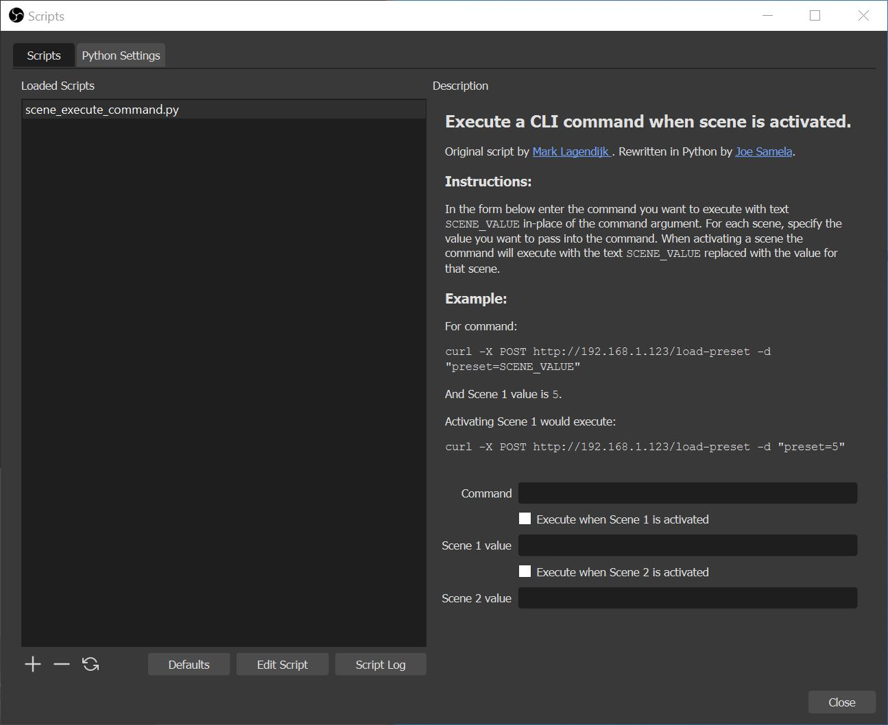

# obs-scene-execute-command-script
OBS script for executing any CLI command whenever whenever a scene is activated.

The original version of this script was written by [marklagendijk](https://github.com/marklagendijk/obs-scene-execute-command-script) in Lua. marklagendijk's version of the script called the CLI command from Lua using `os.execute(scene_command)` which opens a command window that stayed open while the command is run. This got very annoying when screen captuing and switching scenes, because the command prompt would pop-up and be visible on stream! 

To solve this, I rewrote the script in python and instead call the CLI command using `os.system(scene_command)`. My version of the script functions identically to the original, except for silent execution (ie. no window pop-up) and a more detailed description. 

Happy obs-ing!
